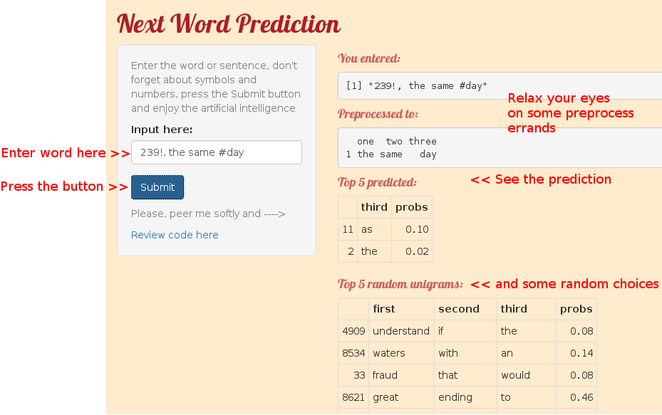

Word Prediction Data Product
========================================================
author: Katerina Sergeeva
date: April, 2016
autosize: false

Data Science Capstone Project.
Final Presentation

Introduction
========================================================

The goal of Data Science specialisation final project was to explore algorythmic part of word prediction, implement the web-based Data Product application using Shiny.io service and find the right words to explain for your family and friends (and possible investors) what exactly you been doing for almost two months avoiding social contacts.

Language model for word prediction
========================================================

Prediction algorithm uses the n-gram language model built with RStudio friendly Natural Language Processing techniques:
> tm and RWeka packages

and Markov’s assumption:
> the next word can be predicted with some probability based on a few previos words.

Language model were built on data from corpus HC Corpora and external data sets for profanity filtering and non-english words cleansing. Initial model based on 70% of corpus data with up to 5-grams calculated, but then was reduced to short 3-gram model with very limited predictive power to optimise responce time.

Word prediction algorythm
========================================================

"Backing-off"" to [Milestone report](http://rpubs.com/once_again_wfslithtaivs/162775) the algorythmic part were changed a bit and final [WordPredict Application] (https://wfslithtaivs.shinyapps.io/PredictApplication/) implements the following logic:

1. App is reading the input after "Submit" button is pressed.
2. Preprocessing input (lowering case, remove punctuation, trim white spaces)
3. Looking up for all possible endings (among 2- and 3-grams)
4. Backing-of to the lower-grams applying reduction factor (0.4 for 2-grams, 0.16 for top unigrams).
5. Put all predictions together, sort desc by probability and show the top-5 predicted words.

User Interface Overview
========================================================

